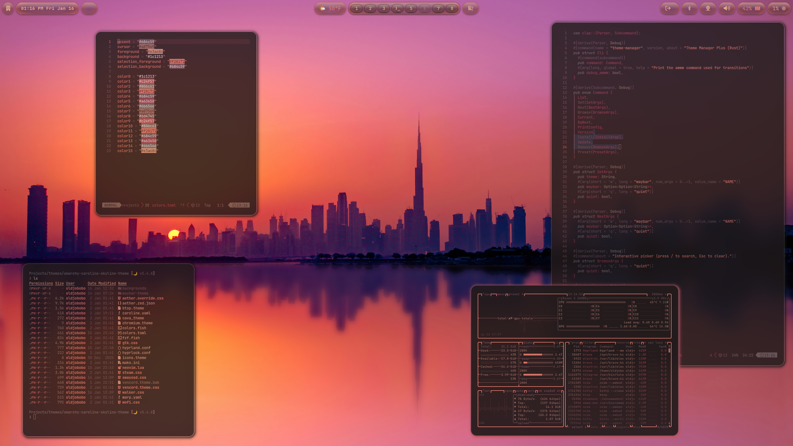

# Omarchy Caroline Skyline Theme

Caroline Skyline blends warm clay browns, dusty rose, and ember accents into a cozy, late-night city glow with soft contrast.

## Preview



## Install

Use the Omarchy theme installer:

```bash
omarchy-theme-install https://github.com/OldJobobo/omarchy-caroline-skyline-theme
```

## What's included

- Hyprland rules and opacity tuning (`hyprland.conf`)
- Hyprlock styling (`hyprlock.conf`)
- Waybar theme (`waybar-theme/`)
- Terminal palette (`colors.toml`) and Warp (`warp.yaml`)
- Shell/tools: Fish colors (`colors.fish`), fzf (`fzf.fish`)
- Apps/UI: GTK (`gtk.css`), Chromium (`chromium.theme`), Wofi (`wofi.css`), Walker (`walker.css`)
- System tools: btop (`btop.theme`), cava (`cava_theme`), Mako (`mako.ini`), SwayOSD (`swayosd.css`)
- Extras: Steam (`steam.css`), Vencord (`vencord.theme.css`), Aether overrides (`aether.override.css`, `aether.zed.json`), icons pointer (`icons.theme`), Neovim (`neovim.lua`)

## Wallpapers

<table>
  <tr>
    <td></td>
    <td></td>
    <td></td>
  </tr>
  <tr>
    <td></td>
    <td></td>
    <td></td>
  </tr>
</table>

## Attribution

- Caroline palette by ed (https://codeberg.org/ed)
